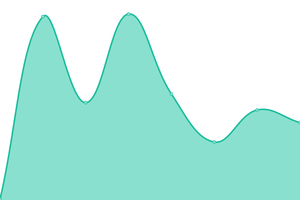
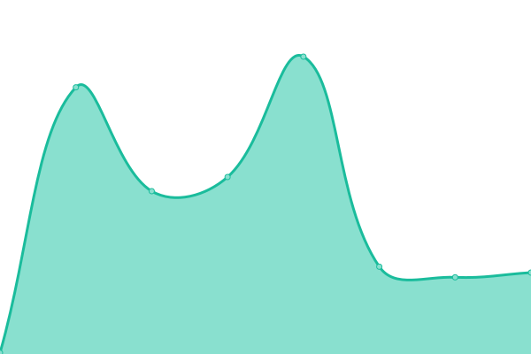
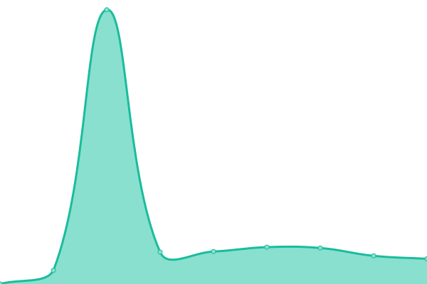
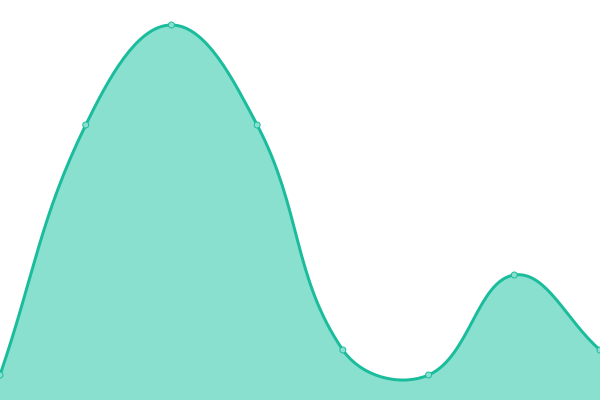
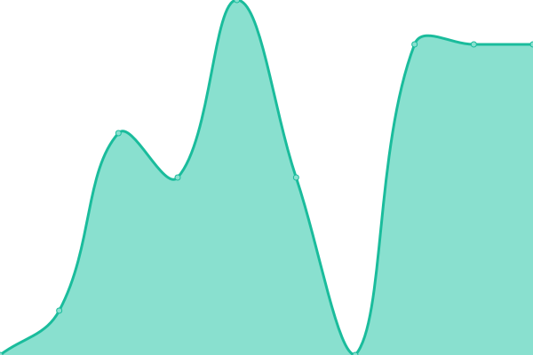

# [📈 Live Status](https://schnow265.github.io/uptime): <!--live status--> **🟧 Partial outage**

This repository contains the open-source uptime monitor and status page for [schnow265](https://github.com/schnow265), powered by [Upptime](https://github.com/upptime/upptime).

<!--start: status pages-->
<!-- This summary is generated by Upptime (https://github.com/upptime/upptime) -->
<!-- Do not edit this manually, your changes will be overwritten -->
<!-- prettier-ignore -->
| URL | Status | History | Response Time | Uptime |
| --- | ------ | ------- | ------------- | ------ |
|  [Kagi](https://www.kagi.com) | 🟩 Up | [kagi.yml](https://github.com/schnow265/uptime/commits/HEAD/history/kagi.yml) | 

 220ms
     
 | 

<a href="https://schnow265.github.io/uptime/history/kagi">100.00%</a>
    

|  [DuckDuckGo](https://www.duckduckgo.com) | 🟩 Up | [duck-duck-go.yml](https://github.com/schnow265/uptime/commits/HEAD/history/duck-duck-go.yml) | 

 290ms
     
 | 

<a href="https://schnow265.github.io/uptime/history/duck-duck-go">100.00%</a>
    

|  [Google](https://www.google.com) | 🟥 Down | [google.yml](https://github.com/schnow265/uptime/commits/HEAD/history/google.yml) | 

 174ms
     
 | 

<a href="https://schnow265.github.io/uptime/history/google">100.00%</a>
    

|  [Bing](https://www.bing.com) | 🟩 Up | [bing.yml](https://github.com/schnow265/uptime/commits/HEAD/history/bing.yml) | 

 138ms
     
 | 

<a href="https://schnow265.github.io/uptime/history/bing">100.00%</a>
    

|  [Wikipedia](https://www.wikipedia.org) | 🟩 Up | [wikipedia.yml](https://github.com/schnow265/uptime/commits/HEAD/history/wikipedia.yml) | 

 127ms
     
 | 

<a href="https://schnow265.github.io/uptime/history/wikipedia">100.00%</a>
    

|  [Internet Archive](https://www.archive.org) | 🟩 Up | [internet-archive.yml](https://github.com/schnow265/uptime/commits/HEAD/history/internet-archive.yml) | 

 522ms
     
 | 

<a href="https://schnow265.github.io/uptime/history/internet-archive">100.00%</a>
    

|  [Software Heritage Archive](https://archive.softwareheritage.org) | 🟩 Up | [software-heritage-archive.yml](https://github.com/schnow265/uptime/commits/HEAD/history/software-heritage-archive.yml) | 

 718ms
     
 | 

<a href="https://schnow265.github.io/uptime/history/software-heritage-archive">100.00%</a>
    

|  [Talilscale API](https://api.tailscale.com/api) | 🟩 Up | [talilscale-api.yml](https://github.com/schnow265/uptime/commits/HEAD/history/talilscale-api.yml) | 

 435ms
     
 | 

<a href="https://schnow265.github.io/uptime/history/talilscale-api">100.00%</a>
    

|  [GitHub](https://github.com) | 🟩 Up | [git-hub.yml](https://github.com/schnow265/uptime/commits/HEAD/history/git-hub.yml) | 

 293ms
     
 | 

<a href="https://schnow265.github.io/uptime/history/git-hub">100.00%</a>
    

|  [Cloudflare](https://www.cloudflare.com) | 🟩 Up | [cloudflare.yml](https://github.com/schnow265/uptime/commits/HEAD/history/cloudflare.yml) | 

 391ms
     
 | 

<a href="https://schnow265.github.io/uptime/history/cloudflare">100.00%</a>
    

|  [Cloudflare Status](https://www.cloudflarestatus.com) | 🟩 Up | [cloudflare-status.yml](https://github.com/schnow265/uptime/commits/HEAD/history/cloudflare-status.yml) | 

 278ms
     
 | 

<a href="https://schnow265.github.io/uptime/history/cloudflare-status">100.00%</a>
    

|  [Google DNS](8.8.8.8) | 🟩 Up | [google-dns.yml](https://github.com/schnow265/uptime/commits/HEAD/history/google-dns.yml) | 

 4ms
     
 | 

<a href="https://schnow265.github.io/uptime/history/google-dns">100.00%</a>
    

|  [Cloudflare DNS](1.1.1.1) | 🟩 Up | [cloudflare-dns.yml](https://github.com/schnow265/uptime/commits/HEAD/history/cloudflare-dns.yml) | 

 6ms
     
 | 

<a href="https://schnow265.github.io/uptime/history/cloudflare-dns">100.00%</a>
    

|  [Quad9 DNS](9.9.9.9) | 🟩 Up | [quad9-dns.yml](https://github.com/schnow265/uptime/commits/HEAD/history/quad9-dns.yml) | 

 6ms
     
 | 

<a href="https://schnow265.github.io/uptime/history/quad9-dns">100.00%</a>
    

|  [Mistal API](https://api.mistral.ai/) | 🟩 Up | [mistal-api.yml](https://github.com/schnow265/uptime/commits/HEAD/history/mistal-api.yml) | 

 330ms
     
 | 

<a href="https://schnow265.github.io/uptime/history/mistal-api">100.00%</a>
    

|  [OpenAI API](https://api.openai.com) | 🟩 Up | [open-ai-api.yml](https://github.com/schnow265/uptime/commits/HEAD/history/open-ai-api.yml) | 

 57ms
     
 | 

<a href="https://schnow265.github.io/uptime/history/open-ai-api">100.00%</a>
    

<!--end: status pages-->

[**Visit our status website →**](https://schnow265.github.io/uptime)

## 📄 License

- Powered by: [Upptime](https://github.com/upptime/upptime)
- Code: [MIT](./LICENSE) © [Anand Chowdhary](https://anandchowdhary.com), supported by [Pabio](https://pabio.com)
- Data in the `./history` directory: [Open Database License](https://opendatacommons.org/licenses/odbl/1-0/)
